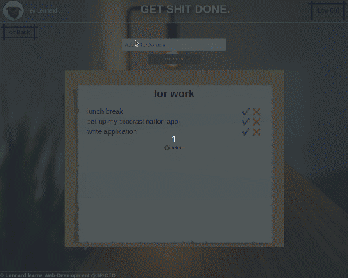
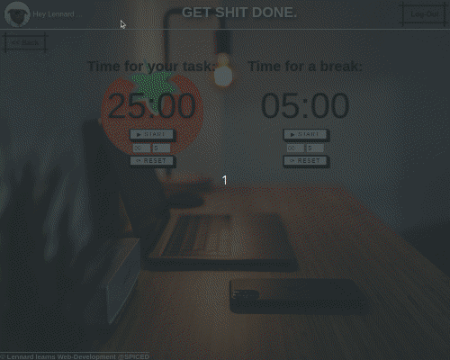

This App started as my last project of the SPICED Web Development Bootcamp. It is meant as a helpful tool to help procrastinators getting their tasks done and organise themselves. 

Current functionalities include:

1) Creating and deleting To-Do lists, inserting tasks and to-do's, which can be ticked off as done, which will trigger a randomised motivational message.

2) Pomodoro timer with work time and break time, each adjustable to desired times. After each timer runs out, it will trigger a sound for break time and work time.

Now after graduation I am step by step trying to implement new functionalities, e.g. an advanced To-Do list, that allows you to provide descriptions to single tasks/to-dos
